# Fast Learning English App 📚🇬🇧

An educational app designed to help users learn English through structured lessons and interactive content.

## ✨ Features
- 🖌️ Modern, user-friendly UI built with Flutter
- 🔗 REST API integration to fetch dynamic content
- 🔊 Audio playback support for pronunciation
- 🧠 Interactive quizzes to reinforce learning
- 📦 Offline access with local caching (SQLite)

## 🛠️ Technologies Used
- Flutter
- Dart
- REST API
- BLoC State Management
- SQLite

## 📸 Screenshots
| onBoarding |
|-------------|-----------------------------------------|
| 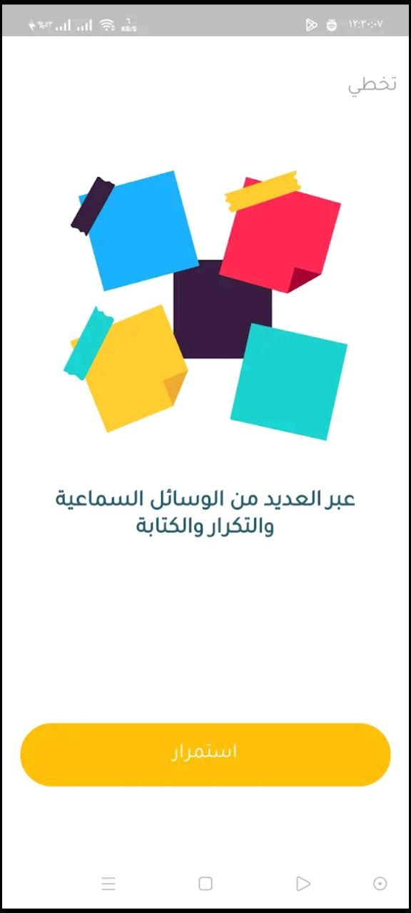 |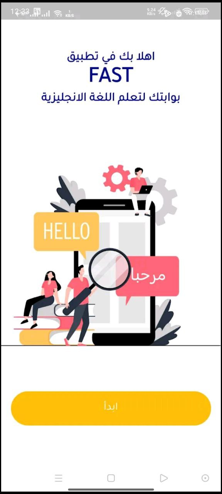 | | ||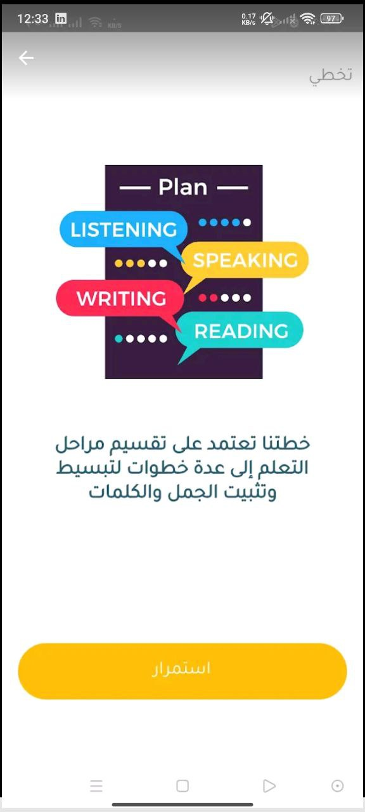 ||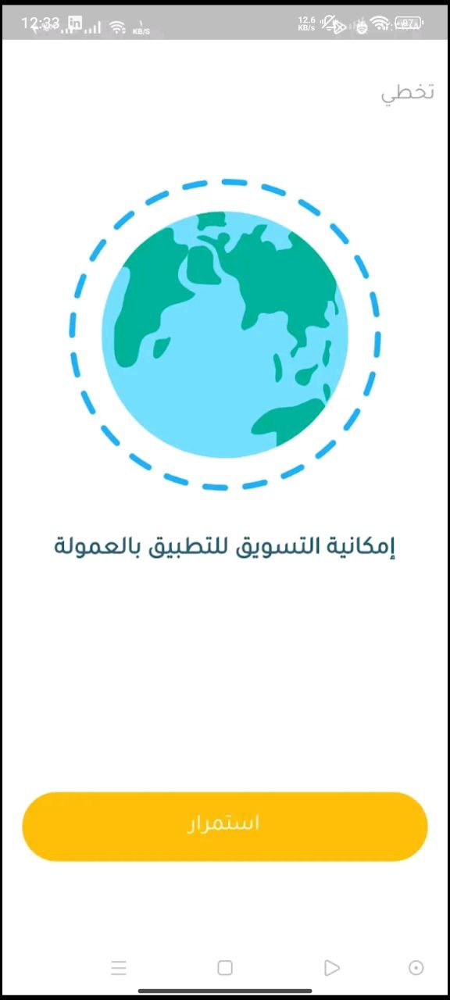 |
| SignIn |
|-------------|-----------------------------------------|
| 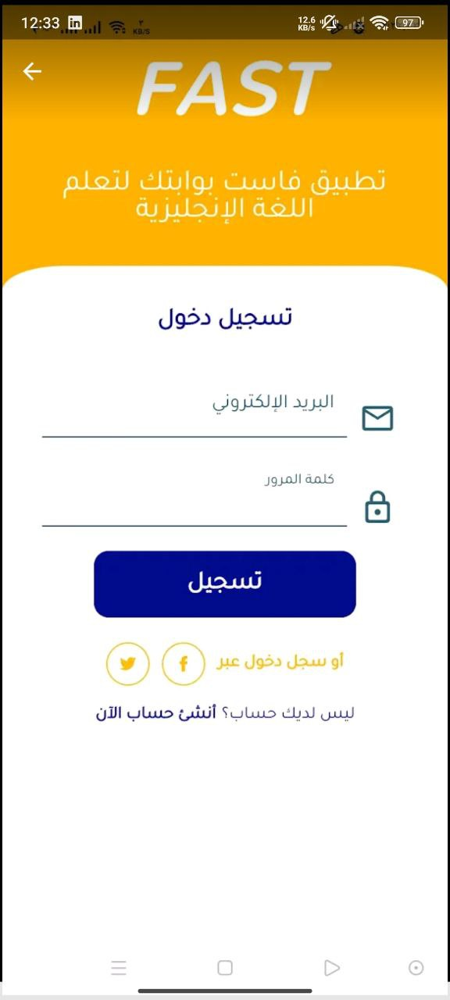
| Home Screen | 
|-------------|-----------------------------------------|
| 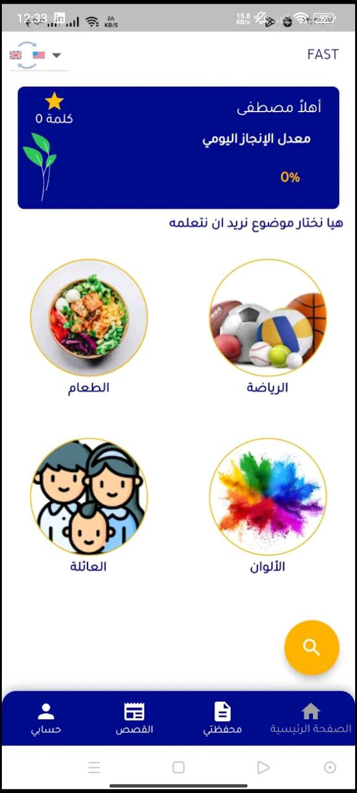 | 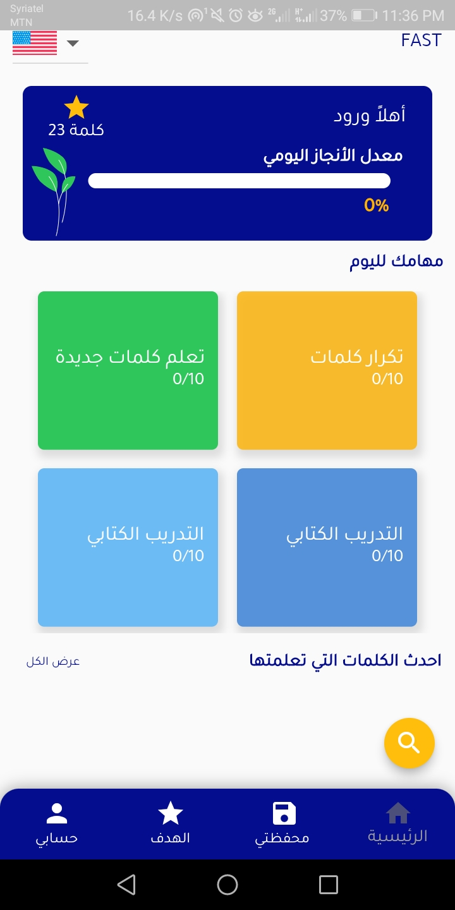
| MY Wallet |
|-------------|-----------------------------------------|
| 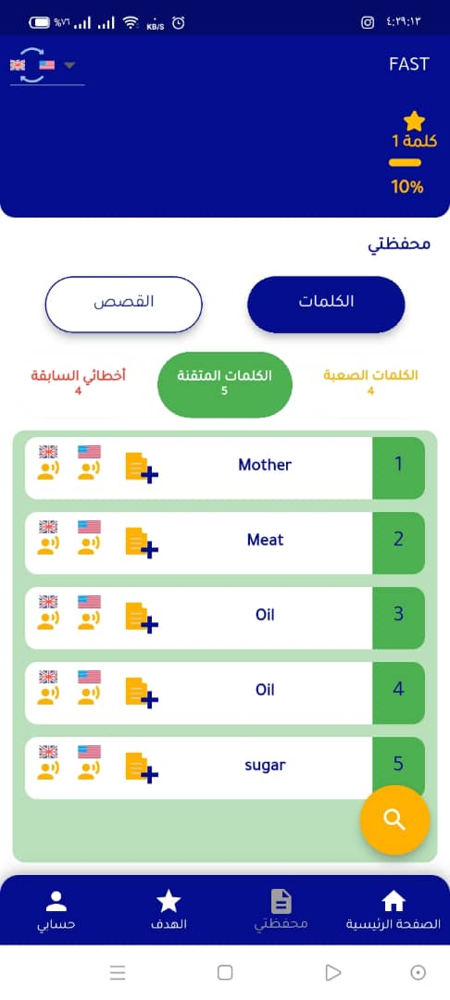
| Select Learn Time |
|-------------|-----------------------------------------|
| 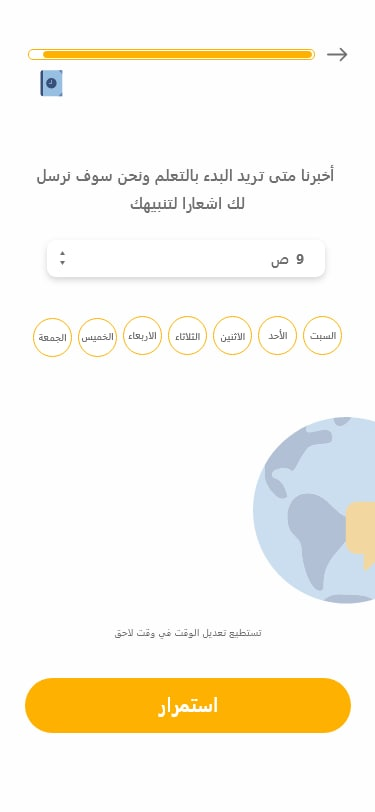
|Learned Words|
|-------------|-----------------------------------------|
| 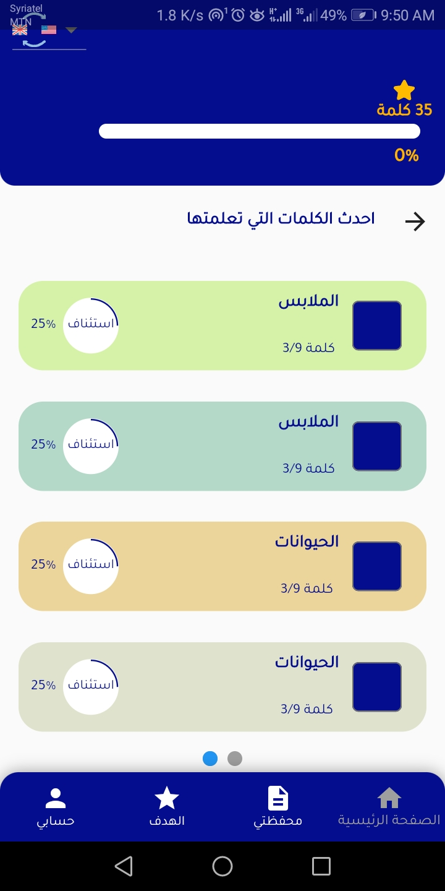
|Result|
|-------------|-----------------------------------------|
| 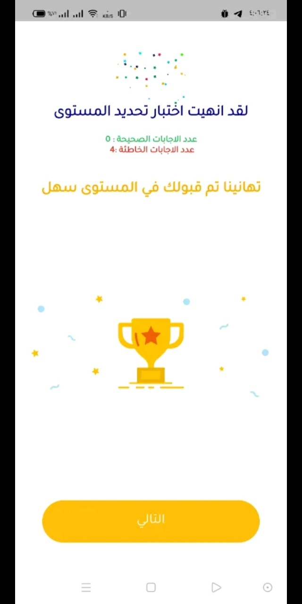

## 🚀 Getting Started
Coming soon: setup and build instructions

---

Feel free to open issues or submit pull requests!
